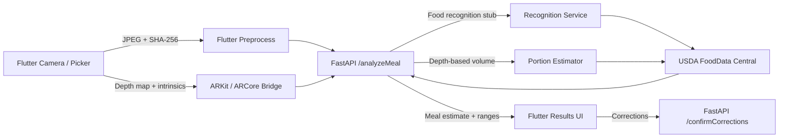

# BolusBuddy Architecture

## Data Flow (Depth Preferred)

## Capture Modes

- **Depth Capture (preferred)**: ARKit/ARCore depth + RGB + intrinsics.
- **Quick Photo**: single RGB image capture.
- **Multi-angle fallback**: multiple photos for better recognition when depth is missing.

## Capability Detection

- Flutter queries `bolusbuddy/depth` channel.
- iOS: ARKit sceneDepth/smoothedSceneDepth support.
- Android: ARCore Depth API support.

## Caching Strategy

- **Image hash (SHA-256)** used as cache key on backend.
- In-memory TTL cache for meal analysis.
- USDA food results cached aggressively (24h) and persisted in SQLite.

## Latency Target

- Target: **<2s p95** for cached meals.
- Non-cached path uses lightweight recognition stub + USDA lookup cache.

## Uncertainty Propagation

- Each item has confidence from recognition.
- Nutrient ranges expand as confidence decreases.
- Totals are computed by summing min/max across items.

## Safety (Type 1 Diabetes)

- Net carbs = carbs − fiber returned explicitly.
- Low-confidence warnings are shown in UI.
- Clear “decision support only” messaging.

## Free-Tier Guarantees

- Cloud Run `minScale: 0` and `maxScale: 1` to avoid idle costs.
- No paid APIs; USDA FoodData Central only.
- Aggressive caching to stay within free USDA quotas.
